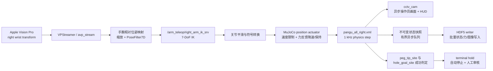

# Pangu MuJoCo + Apple Vision Pro 遥操作数据采集系统

本仓库是一个基于 ROS、Apple Vision Pro 与 MuJoCo 的右臂插孔遥操作数据采集系统。当前默认任务使用 `model/pangu_all_right.xml`，通过 Vision Pro 右手腕位姿生成机械臂末端目标，调用右臂逆运动学服务得到 7 关节目标，再由 MuJoCo position actuator 执行接触仿真。每条 episode 可同步记录机器人状态、控制指令、末端六维力和两路离屏相机图像，并在插孔成功后自动停止录制、等待人工保留或丢弃。

> 完整运行依赖 Linux + ROS。本项目的 `teleop` Conda 环境可用于 Python 依赖管理；Windows 环境适合代码审查、模型解析和不依赖 ROS 节点通信的测试，不用于启动完整遥操作链路。

## 1. 当前默认系统

| 项目 | 当前实现 |
| --- | --- |
| ROS 包名 | `arm_teleop` |
| 主入口 | `vptele/main_mujoco.py` |
| 主配置 | `vptele/config/config_arm_right_peg.yaml` |
| MuJoCo 控制器 | `vptele/arm_control/robot_controller_mujoco_peg_tool_contact.py` |
| MuJoCo 模型 | `model/pangu_all_right.xml` |
| IK 启动文件 | `launch/teleop_service.launch` |
| 录制客户端 | `scripts/recording_keyboard_client.py` |
| HDF5 录制器 | `vptele/utils/mujoco_hdf5_recorder.py` |
| 操作员画面 | `cctv_cam`，OpenCV 窗口，可叠加力反馈 HUD |
| 数据集相机 | `ee_cam`、`base_top_cam`，只离屏渲染并写入 HDF5 |
| MuJoCo Viewer | 默认关闭，不参与数据采集 |

默认配置下，系统启动后不会立即接受遥操作命令。按键客户端开始一条 episode 时，录制服务会统一完成“停止旧控制线程 → 机械臂复位 → 清除报警 → 重新标定手部 → 开始录制 → 启动新控制线程”，从而避免上一条 episode 的滤波状态、目标位置或复位动作污染下一条数据。

## 2. 系统架构与数据流



### 2.1 启动阶段

1. `main_mujoco.py` 初始化 ROS 节点 `teleop_system`，读取 `~config_path`，默认是 `config/config_arm_right_peg.yaml`（相对于 `vptele/main_mujoco.py` 所在目录）。
2. `TeleopSystemMujoco` 连接配置中的 `vp_ip`，创建 `VPStreamer`，等待有效的 `right_wrist` 4×4 变换矩阵。
3. 控制器加载 `pangu_all_right.xml`，缓存关节、执行器、传感器、site、geom 与相机 ID，然后启动 MuJoCo 物理线程。
4. `ArmTeleopMujoco` 等待 `/arm_teleop/right_arm_ik_srv`，完成初次右手参考标定，并注册 episode 生命周期服务：
   - `/arm_teleop_mujoco/stop`
   - `/arm_teleop_mujoco/recalibrate`
   - `/arm_teleop_mujoco/start`
5. MuJoCo 控制器注册 `/mujoco_hdf5_recording/set_recording`。当 `teleop_controlled_by_recording: true` 时，遥操作线程等待录制服务启动，不会在主节点启动后立即运动。

### 2.2 单个控制周期

`ArmTeleopMujoco.control_loop()` 默认以 `arm_config.update_frequency: 0.01`，即目标周期约 100 Hz 运行：

1. 读取 Vision Pro 最新右手腕变换矩阵。
2. 相对 episode 开始时的手腕参考计算位移与姿态变化。
3. 将手部坐标轴映射到机器人坐标系，位置乘以 `scaling_factor`。
4. 将目标姿态转换为 `[x, y, z, qw, qx, qy, qz]`，经过 `PoseFilter7D`。
5. 调用右臂 `ArmIK` 服务，使用 `optimal_ref` 方法和上一帧关节角作为参考。
6. 对成功的 7 关节解进行平滑，然后调用 `set_arm_positions()`。
7. 控制器进行外部/内部关节符号转换，并在每个 MuJoCo timestep 内按最大关节速度逐步逼近目标。

模型的 `timestep` 为 `0.001 s`，物理仿真目标频率为 1 kHz。`realtime: true` 时，物理线程用单调时钟对齐真实时间；如果机器暂时落后超过 0.1 s，会重置下一步 deadline，避免持续追赶造成更严重的卡顿。

### 2.3 接触保护与质量标记

默认启用以下机制：

- 力感知速度缩放：补偿后力达到 `40 N` 后将关节目标速度缩放到 `0.4`，达到 `80 N` 后缩放到 `0.15`。
- 高力保持：力达到 `100 N` 并持续 `0.15 s` 后保持当前关节位置；释放阈值由 `high_force_hold_release_ratio` 控制。
- 关节力矩报警：按 7 个关节分别检查阈值，触发时写入 `joint_torque_over_limit` 事件。
- 末端六维力报警：分别检查合力 `100 N`、合力矩 `3 Nm`，持续 `0.25 s` 后写入 `ft_wrench_over_limit` 事件。
- 报警默认只在 HDF5 正在录制时检查，并在当前 episode 内锁存。peg 颜色用于提示关节报警、FT 报警或二者同时发生。

这些报警是数据质量提示，不等同于任务成功标签。当前 `ft_wrench_alarm_freeze_on_trigger: false`，FT 超限只报警、变色并记录事件，不会自动冻结机械臂。

## 3. 相机与渲染职责

`pangu_all_right.xml` 中有三路任务相机：

| 相机 | 用途 | 默认可视化 | 默认写入数据集 |
| --- | --- | --- | --- |
| `cctv_cam` | 遥操作员观察与力反馈 HUD | 是，15 FPS | 否 |
| `ee_cam` | 末端视角训练数据 | 否 | 是，30 FPS |
| `base_top_cam` | 基座上方全局训练数据 | 否 | 是，30 FPS |

当前性能配置有三点重要设计：

- `launch_viewer: false`：关闭 MuJoCo 官方交互式 viewer，物理仿真不依赖 viewer。
- `monitor_camera_names: ["cctv_cam"]`：实时窗口只渲染操作员需要的 CCTV；`ee_cam` 和 `base_top_cam` 不创建显示窗口。
- `camera_stream_async: true` 与 `hdf5_async_io: true`：CCTV 展示和数据集图像渲染都移出物理主路径。CCTV 队列容量为 1，显示线程落后时丢弃旧画面、保留最新画面；HDF5 队列是有界队列，默认容量 4096，不静默丢样本。

力反馈 HUD 只绘制在 OpenCV 操作员画面上。HDF5 相机图像由独立 renderer 从采样时的 MuJoCo 状态快照重建，因此不会包含 HUD。

## 4. 环境与依赖

### 4.1 ROS 与系统依赖

推荐在 ROS Noetic 对应的 Ubuntu 环境运行。仓库是 catkin 包，需要至少具备：

- ROS：`roscpp`、`rospy`、`std_msgs`、`sensor_msgs`、`trajectory_msgs`、`geometry_msgs`、`message_generation`、`message_runtime`、`std_srvs`
- C++：Eigen、yaml-cpp、Ceres
- 机械臂逆解库：`/usr/local/lib/libarm_kinematics.so`

当前 `CMakeLists.txt` 直接链接 `/usr/local/lib/libarm_kinematics.so` 与 `/usr/lib/libceres.so`。如果目标机器安装位置不同，需要先调整路径或建立正确的系统链接。

### 4.2 Python 环境

```bash
conda activate teleop
pip install numpy scipy PyYAML avp_stream mujoco h5py opencv-python
```

如果 `avp_stream` 来自内部源，请按实际包源安装。使用 Conda Python 运行 ROS 节点时，应确认该环境能导入系统的 `rospy` 与 catkin 生成的 `arm_teleop.srv`。

### 4.3 构建 ROS 包

假设仓库位于 `~/catkin_ws/src/arm_teleop`：

```bash
cd ~/catkin_ws
catkin_make
source devel/setup.bash
```

每个新终端都需要激活同一 Python 环境并 source 工作空间：

```bash
conda activate teleop
source /opt/ros/noetic/setup.bash
source ~/catkin_ws/devel/setup.bash
```

## 5. 运行前配置

编辑 `vptele/config/config_arm_right_peg.yaml`，至少确认：

```yaml
vp_ip: "192.168.1.144"
mujoco_model_path: "/home/<user>/catkin_ws/src/arm_teleop/model/pangu_all_right.xml"
hdf5_record_dir: "/home/<user>/data/peg_hole"
```

所有路径必须是运行机器上的有效 Linux 路径。建议同时核对：

- Vision Pro 与运行主机位于可互通网络，Vision Pro 端 tracking stream 已启动。
- `mujoco_model_path` 指向本仓库的 `pangu_all_right.xml`。
- `hdf5_record_dir` 所在磁盘有足够空间和持续写入带宽。
- `hdf5_camera_names` 保持为模型中存在的 `ee_cam`、`base_top_cam`。
- `hdf5_peg_geom_name`、`hdf5_hole_ring_reference_geom_name`、`hdf5_hole_back_stop_geom_name`、`hdf5_hole_reference_site_name` 与 XML 名称一致。
- `arm_config.move` 未配置时默认为 `true`，IK 成功后会向 MuJoCo 控制器发送目标。

## 6. 完整启动流程

以下命令分别在不同终端执行，并且每个终端都已激活 `teleop` 环境、source ROS 与 catkin 工作空间。

### 6.1 启动 ROS Master

```bash
roscore
```

### 6.2 启动逆运动学服务

```bash
roslaunch arm_teleop teleop_service.launch
```

该 launch 当前同时启动 `ik_service_left_node` 和 `ik_service_right_node`。本流程只使用右臂服务 `/arm_teleop/right_arm_ik_srv`，但不要在采集过程中关闭右臂 IK 节点。

### 6.3 启动 MuJoCo 遥操作主节点

```bash
rosrun arm_teleop main_mujoco.py
```

显式指定配置时：

```bash
rosrun arm_teleop main_mujoco.py \
  _config_path:=config/config_arm_right_peg.yaml
```

启动成功后应看到：

- Vision Pro `right_wrist` 数据就绪；
- 右臂 IK 服务连接成功；
- MuJoCo 模型加载成功；
- `/mujoco_hdf5_recording/set_recording` ready；
- `/arm_teleop_mujoco/{stop,recalibrate,start}` ready；
- CCTV 窗口出现，但机械臂尚未进入本条 episode 的遥操作线程。

### 6.4 启动键盘录制客户端

```bash
rosrun arm_teleop recording_keyboard_client.py
```

客户端会等待 `/mujoco_hdf5_recording/set_recording`。首次按 Enter 开始 `teleop_001`，再次按 Enter 停止并询问是否保留。之后依次使用 `teleop_002`、`teleop_003` 等 label。

## 7. 一条 episode 的完整生命周期

### 7.1 按 Enter 开始

键盘客户端发送：

```text
record = true
keep   = true
label  = teleop_NNN
```

录制服务按以下顺序执行：

1. 拒绝新的遥操作命令。
2. 调用 `/arm_teleop_mujoco/stop`，确保旧控制线程退出。
3. 按 `initial_arm_joints` 复位 MuJoCo 机械臂。
4. 清除上一条 episode 的关节力矩报警、FT 报警、任务成功状态与力滤波状态。
5. 如果启用孔位随机化，移动 `wall_task`。当前默认关闭随机化。
6. 调用 `/arm_teleop_mujoco/recalibrate`，把当前 Vision Pro 右手位姿设为新参考，并重置位姿/关节滤波器。
7. 创建 episode 目录、HDF5 文件和元数据，启动异步 writer。
8. 开放控制器命令入口。
9. 调用 `/arm_teleop_mujoco/start`，启动该 episode 的遥操作线程。

这样可以保证 HDF5 第一帧已经是复位后的机器人状态，结束后的复位动作不会写进本条数据。

### 7.2 手动停止

录制中再次按 Enter，客户端先询问：

```text
Stop recording. Keep this episode? [Y/n]:
```

- 输入 Enter、`y` 或 `yes`：`keep=true`，完成写盘并保留 episode。
- 输入 `n`、`no`、`0` 或 `false`：`keep=false`，完成写盘和复位后删除整个 episode 目录。

停止路径会先拒绝新命令并停止遥操作线程，再排空 HDF5 异步队列、写入最终元数据和 events、关闭文件，最后复位机械臂。复位发生在录制 inactive 之后，不进入数据集。

### 7.3 任务成功自动停止

默认成功条件是：

```text
distance(peg_tip_site, hole_goal_site) <= 0.008 m
并连续保持至少 0.10 s
且 HDF5 recording active
```

触发后系统：

1. 写入 `task_success_site_reached` 与 `terminal_hold_start` 事件。
2. 停止接受新的遥操作命令。
3. 用 `0.2 s` 将 actuator command 平滑过渡到当前实际 qpos。
4. 继续保持并录制到 terminal hold 总时长 `1.0 s`。
5. 写入 `auto_stop_task_success`，自动关闭 HDF5，并临时保留 episode。
6. 操作员在键盘客户端再次按 Enter，选择最终保留或丢弃。

注意：自动停止后键盘客户端不会主动轮询录制状态。它仍等待下一次 Enter，把该次操作作为成功 episode 的人工审核，这是当前设计的一部分。

## 8. 录制服务接口

服务定义位于 `srv/SetRecording.srv`：

```text
bool record
bool keep
string label
---
bool success
bool active
string message
string episode_path
```

也可以不用键盘客户端，直接调用：

```bash
rosservice call /mujoco_hdf5_recording/set_recording \
  "record: true
keep: true
label: 'manual_001'"
```

保留并停止：

```bash
rosservice call /mujoco_hdf5_recording/set_recording \
  "record: false
keep: true
label: ''"
```

停止并删除：

```bash
rosservice call /mujoco_hdf5_recording/set_recording \
  "record: false
keep: false
label: ''"
```

不要并发发送 start/stop 请求。控制器内部会串行化 recording transition，但上层采集流程仍应一次只操作一条 episode。

## 9. 数据目录和 HDF5 结构

每条保留的 episode 目录命名为：

```text
<hdf5_record_dir>/YYYYMMDD_HHMMSS_<label>/
├── episode.hdf5
└── metadata.json
```

`episode.hdf5` 使用统一的 MuJoCo `data.time` 作为对齐时钟。不同频率的数据流使用各自时间戳，不应假设状态、力和图像逐行一一对应。

```text
episode.hdf5
├── action                              # [N_state, 7]，ACT 兼容别名
├── actions/
│   └── joint_pos_command               # [N_state, 7]，实际 data.ctrl 指令
├── observations/
│   ├── ee_pose                         # [N_state, 7]，x y z qw qx qy qz
│   ├── joint_pos                       # [N_state, 7]
│   ├── joint_vel                       # [N_state, 7]
│   ├── joint_torque                    # [N_state, 7]
│   ├── ft_wrench                       # [N_force, 6]，补偿后 Fx Fy Fz Tx Ty Tz
│   ├── ft_wrench_raw                   # [N_force, 6]，MuJoCo 原始传感器值
│   ├── ft_wrench_gravity               # [N_force, 6]，传感器系预测重力 wrench
│   └── images/
│       ├── camera_names
│       ├── ee_cam                      # [N_image, 480, 640, 3] uint8 RGB
│       └── base_top_cam                # [N_image, 480, 640, 3] uint8 RGB
├── timestamps/
│   ├── state                           # MuJoCo 绝对仿真时间
│   ├── state_episode                   # 相对 episode 起点
│   ├── force
│   ├── force_episode
│   ├── image
│   └── image_episode
├── episode_metadata/
│   ├── task/                           # 模型尺寸、goal site 与成功规则
│   ├── initial_*                       # episode 初始状态
│   ├── final_*                         # episode 结束状态
│   ├── joint_names
│   ├── actuator_names
│   └── camera_names
└── events/
    ├── names
    ├── t_sim
    ├── t_episode
    └── t_wall
```

默认采样率：

| 数据 | 配置 | 默认频率 |
| --- | --- | --- |
| FT wrench | `hdf5_force_hz` | 500 Hz |
| 机器人状态与 action | `hdf5_state_hz` | 30 Hz |
| 两路数据集图像 | `hdf5_image_hz` | 30 Hz |
| CCTV 操作员画面 | `camera_stream_fps` | 15 Hz，不写入 HDF5 |

图像存储为 HDF5 内部 uint8 RGB tensor。`hdf5_image_format` 和 `hdf5_jpg_quality` 目前仅保留兼容性，不表示数据以 JPG 文件形式写出。

## 10. Peg / hole 与任务元数据

录制器不会只写一份手工描述，而是在每条 episode 开始时按配置名称从实际加载的 MuJoCo model 中读取尺寸和位置。

当前 `pangu_all_right.xml` 的关键值：

| 字段 | 当前值 | 来源/约定 |
| --- | --- | --- |
| peg geom | `cylindrical_peg` | cylinder |
| peg 半径 | `0.010 m` | `geom_size[0]` |
| peg 长度 | `0.090 m` | `2 * geom_size[1]` |
| hole 内半径 | `0.014 m` | ring 中心半径减 `wall_hole_ring_00` 半厚度 |
| hole 深度 | `0.023487 m` | ring 前表面到 `hole_back_stop` 前表面的 local-Y 距离 |
| 成功判定 peg site | `peg_tip_site` | 世界坐标动态计算 |
| hole goal site | `hole_goal_site` | local position `[0, -0.016, 0]` |
| 成功距离阈值 | `0.008 m` | 配置项 |
| 成功 dwell | `0.10 s` | 配置项 |

这些值写入 `episode_metadata/task` 和旁路 `metadata.json.task_metadata`，包括：

- 模型文件名和关键 geom/site 名称；
- peg radius、diameter、half length、length；
- hole inner radius、diameter、depth 及 depth 计算约定；
- `hole_goal_site` 的 local position、size、episode 初始/最终世界坐标；
- 成功条件类型 `site_distance_dwell`、阈值、dwell、terminal hold 和人工审核设置；
- `task_success_detected`。

如果替换模型或修改 peg/hole 几何，必须同步修改 YAML 中的 `hdf5_*_name` 和 `task_success_*_site_name`。只要名称仍能定位到正确对象，尺寸元数据会随模型自动更新。

## 11. 异步录制与性能参数

物理线程只在锁内读取当前状态并创建不可变快照。HDF5 writer 线程负责：

1. 从有界队列取样；
2. 最多按 `hdf5_write_batch_size` 聚合样本；
3. 在独立的 MuJoCo model/data/renderer 中重建采样状态并渲染 `ee_cam`、`base_top_cam`；
4. 批量扩展 HDF5 dataset 并写入；
5. stop 时先排空队列，再写最终元数据并关闭文件。

关键调优项：

| 参数 | 默认值 | 作用 |
| --- | ---: | --- |
| `launch_viewer` | `false` | 避免官方 viewer 的额外渲染与同步开销 |
| `camera_stream_async` | `true` | CCTV 渲染/窗口从物理循环解耦 |
| `hdf5_async_io` | `true` | 图像渲染和磁盘写入从物理循环解耦 |
| `hdf5_async_queue_size` | `4096` | 写盘突发时的样本缓冲上限 |
| `hdf5_write_batch_size` | `128` | 单次批量写入的最大样本数 |
| `hdf5_max_buffer_rows` | `500000` | 单条 episode 的安全上限 |

如果 writer 队列持续满 1 秒，或样本数超过 `hdf5_max_buffer_rows`，录制会以错误状态停止，而不是静默丢弃训练样本。若低性能机器仍然无法实时运行，建议按以下顺序降低负载：

1. 降低 `hdf5_image_hz`；
2. 降低 `hdf5_image_width` / `hdf5_image_height`；
3. 降低 `camera_stream_fps` 或暂时设置 `show_camera_streams: false`；
4. 确保数据写入 SSD，并避免把 `hdf5_record_dir` 指向网络盘；
5. 最后再评估降低状态采样率。FT 数据通常对接触任务最重要，不建议优先降低 `hdf5_force_hz`。

## 12. 数据读取与快速校验

```python
from pathlib import Path

import h5py


episode = Path("/path/to/episode.hdf5")

with h5py.File(episode, "r") as h5:
    print("status:", h5.attrs["status"])
    print("counts:", h5.attrs["n_state"], h5.attrs["n_force"], h5.attrs["n_image"])

    qpos = h5["observations/joint_pos"][:]
    action = h5["actions/joint_pos_command"][:]
    wrench = h5["observations/ft_wrench"][:]
    ee_rgb = h5["observations/images/ee_cam"][:]

    task = h5["episode_metadata/task"]
    print("peg radius (m):", task.attrs["peg_radius_m"])
    print("peg length (m):", task.attrs["peg_length_m"])
    print("hole radius (m):", task.attrs["hole_inner_radius_m"])
    print("hole depth (m):", task.attrs["hole_depth_m"])
    print("success:", bool(task.attrs["task_success_detected"]))
```

建议每次批量采集前先保留一条短 episode，检查：

- `n_state`、`n_force`、`n_image` 均大于 0；
- 两个相机 dataset 的帧数均等于 `n_image`；
- 图像 shape 是 `(N, 480, 640, 3)` 且颜色为 RGB；
- 时间戳单调递增；
- `action` 与 `actions/joint_pos_command` 一致；
- `metadata.json` 与 HDF5 task metadata 中的模型尺寸符合本次实验；
- 自动完成 episode 包含 `task_success_site_reached`、`terminal_hold_start`、`auto_stop_task_success`。

## 13. 测试

在不启动 ROS 节点的开发环境中，可运行模型与录制器测试：

```bash
conda activate teleop
python -m unittest discover -s test -p "test_pangu_peg_hole_model_metadata.py" -v
python -m unittest discover -s test -p "test_mujoco_hdf5_recorder_integration.py" -v
python -m unittest discover -s test -p "test_robot_controller_mujoco_peg_tool_contact.py" -v
```

测试覆盖：

- `pangu_all_right.xml` 的三路相机及 peg/hole/goal site；
- peg 半径/长度、hole 半径/深度计算；
- headless MuJoCo 物理步进和模型地址缓存；
- 异步 HDF5 状态、力、双相机图像写入；
- task metadata 的关键字段。

这组测试不会验证 ROS Master、IK C++ 服务、Vision Pro 网络和 OpenCV 交互窗口。正式采集前仍需在 Linux/ROS 机器上完成一次端到端 smoke test。

## 14. 常见问题

### 主节点一直等待 IK 服务

确认 `teleop_service.launch` 已启动，检查：

```bash
rosservice list | grep /arm_teleop/right_arm_ik_srv
```

如果 IK 节点启动失败，重点检查 `libarm_kinematics.so`、Ceres 和 yaml-cpp 的路径/ABI。

### Vision Pro 初始化超时

确认配置的 `vp_ip` 正确，Vision Pro tracking stream 已启动，主机和头显网络互通。主节点需要在约 2 秒内收到有效 `right_wrist` 数据。

### 开始录制时报 teleop service 失败

确认以下服务同时存在：

```bash
rosservice list | grep /arm_teleop_mujoco
```

应该包含 `stop`、`recalibrate`、`start`。它们由 `ArmTeleopMujoco` 在主节点初始化时注册。

### CCTV 正常但 HDF5 没有图像

两条路径互相独立。检查 `hdf5_record_images: true`、`hdf5_camera_names`、模型相机名称和 writer 错误日志。CCTV 能显示不代表 `ee_cam` / `base_top_cam` 已成功写盘。

### 录制停止耗时较长

stop 会等待异步队列排空以保证数据完整。如果长时间积压，优先降低图像频率/分辨率或换用更快磁盘，不建议直接强制结束进程。

### 自动成功后再次按 Enter 显示 keep/discard

这是预期行为。HDF5 已在 terminal hold 后自动关闭，但 episode 仍处于待人工审核状态；此次选择决定最终保留还是删除。

### 任务成功误触发或不触发

检查 `peg_tip_site`、`hole_goal_site` 的位置，确认阈值单位是米。误触发可减小 `task_success_distance` 或增大 `task_success_dwell_time`；不触发则反向调整，并先用保存的数据验证两个 site 的实际距离。

## 15. 安全停止

推荐顺序：

1. 如果正在录制，先通过键盘客户端正常停止并选择 keep/discard；
2. `Ctrl+C` 退出键盘客户端；
3. `Ctrl+C` 停止 `main_mujoco.py`，等待控制线程、writer 与 renderer 正常关闭；
4. 停止 IK launch；
5. 最后停止 `roscore`。

不要在 HDF5 writer 尚未排空时直接杀死主进程，否则最后一条 episode 可能缺少最终元数据或文件尾部数据。
